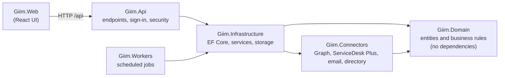
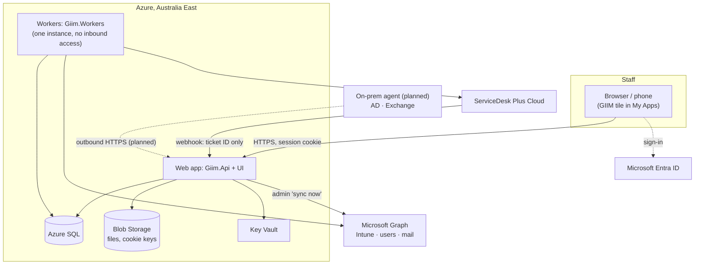
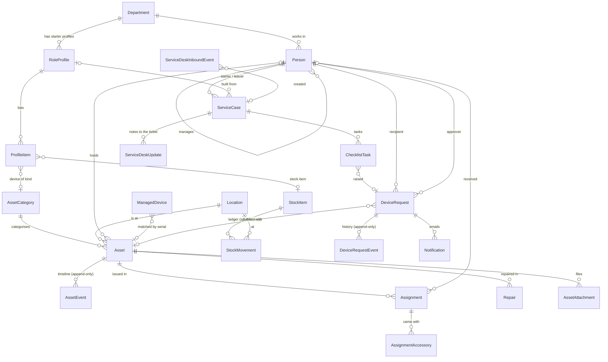
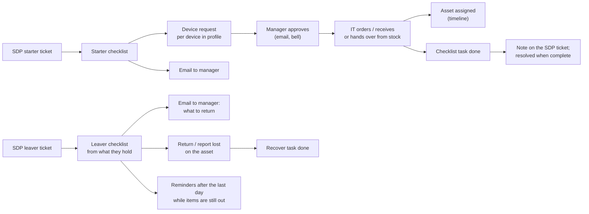

# GIIM design

How GIIM is built, what each feature does, how the features and data relate, and how to test each one. Written
for developers joining the project and for the IT staff reviewing it before go-live.

> **Status (2 October 2026):** the features below are built and tested locally, including a load test at real
> scale. Nothing is deployed yet; [go-live-checklist.md](go-live-checklist.md) lists the steps.
> Account creation and removal in AD, Exchange and Entra are still manual checklist steps; automating them through an
> on-premises agent is the next piece of work ([roadmap.md](roadmap.md), Phase 3).

**Contents:** [1 Purpose](#1-purpose) · [2 Tech stack](#2-tech-stack) · [3 How it fits together](#3-how-it-fits-together) ·
[4 Roles](#4-roles-and-permissions) · [5 Features](#5-features) · [6 Data model](#6-data-model) ·
[7 How features relate](#7-how-the-features-relate) · [8 Design patterns](#8-design-decisions-and-patterns) ·
[9 Background jobs](#9-background-jobs) · [10 Security](#10-security) · [11 Testing](#11-testing) ·
[12 Related documents](#12-related-documents)

---

## 1. Purpose

GIIM is the IT Service Desk's system for **who has what** and **getting people in and out**:

- **A register** of every device and stock item, with a full, unchangeable history of each device.
- **Starters and leavers**: checklists built from a department's starter profile (starters) or from what the person
  actually holds (leavers), started automatically by ServiceDesk Plus tickets.
- **Device requests**: raised by managers or IT, approved by the person's manager, then ordered, received and handed over.
- **Reconciliation with Intune**: which devices Intune knows about that the register doesn't, and the other way round.

Scale it is built and tested for: about 1,500 staff, 34,000 assets, 150,000 Intune devices.

---

## 2. Tech stack

| Area | Technology |
|---|---|
| **Backend** | .NET 10 (C#), ASP.NET Core minimal APIs (`Giim.Api`), a background worker host (`Giim.Workers`) |
| **Data** | SQL Server (Docker locally, Azure SQL in Azure), Entity Framework Core 10 with code-first migrations; files in Azure Blob Storage |
| **Web UI** | React 19, TypeScript 6, Vite 8, lucide-react icons, oxlint. Built into the API and served as static files |
| **Sign-in** | Microsoft Entra ID (OpenID Connect, authorization code + PKCE) from the GIIM tile in My Apps; roles from Entra app roles; HTTP-only session cookie |
| **Integrations** | Microsoft Graph (Intune devices, staff directory, email) through Azure.Identity; ServiceDesk Plus Cloud API v3 (Zoho OAuth) and its webhook |
| **Documents** | ClosedXML (Excel import and export), CSV export, QRCoder (QR codes and label sheets) |
| **Hosting** | Azure, Australia East: App Service (Linux), Azure SQL, Key Vault, Blob Storage, private endpoints, NAT gateway; managed identities throughout |
| **Infrastructure as code** | Bicep templates and PowerShell scripts (`infra/`) |
| **CI/CD** | GitHub Actions: build, test and lint on every change; gated deployment to test, then production after approval |
| **Monitoring** | Application Insights and Log Analytics (OpenTelemetry), alert rules |
| **Testing** | xUnit; ASP.NET Core `WebApplicationFactory` for the API. All automated tests run without a database |
| **Code quality** | .NET analysers at `latest-recommended` with warnings as errors; TypeScript strict; oxlint |

### Projects and how they depend on each other



| Project | Holds |
|---|---|
| `Giim.Domain` | Entities and rules: asset lifecycle, checklist generation, device request workflow, file type rules. Pure C#, fully unit-tested |
| `Giim.Connectors` | Talking to other systems: Graph (Intune, Entra users, email), ServiceDesk Plus, CSV and file stand-ins for each |
| `Giim.Infrastructure` | `GiimDbContext` and migrations, and one service per feature (e.g. `AssignmentService`, `CaseService`, `RequestService`) |
| `Giim.Api` | Minimal API endpoints (`Endpoints/`), sign-in and authorisation (`Security/`), security headers and static UI (`Hosting/`) |
| `Giim.Workers` | Background services: syncs, ServiceDesk Plus, email sending, reminders |
| `Giim.Web` | The UI: `src/pages/` (one file per page or form), `src/App.tsx` (shell, navigation, bell) |
| `tools/SampleData` | Generates the fake test data in `samples/` |
| `infra/` | Bicep templates, deployment and permission scripts |

---

## 3. How it fits together



- **The UI never calls other systems directly.** Workers copy what GIIM needs (Intune devices, staff, tickets) into
  SQL on a schedule, so pages are fast and other systems' rate limits don't matter.
- **The API and workers share one database** and coordinate through it: the API saves "work to do" rows (emails,
  ticket notes, incoming tickets) in the same transaction as the change; the workers pick them up.
- **Everything authenticates with managed identities** in Azure. There are no passwords or connection secrets in
  configuration, apart from the ServiceDesk Plus OAuth credentials and webhook secret, which live in Key Vault.

---

## 4. Roles and permissions

Roles come from Entra app roles (usually through groups), read at sign-in.

| Role | Can |
|---|---|
| **Administrator** | Everything, including set-up lists (categories, locations, starter profiles), register import, directory sync, ServiceDesk Plus and notification settings, approving destructive checklist steps |
| **Technician** | Add, assign, return, repair, retire and move assets; stock; files; starter and leaver checklists; ordering, receiving and handing over devices |
| **Manager** | Read everything; raise device requests; approve or reject requests for their own team; answer questions on their requests |
| **Viewer** | Read everything |

Enforced in the API, not just hidden in the UI:

- Every `/api` endpoint needs a GIIM role (`Policies.Read`).
- Every endpoint that changes data needs Technician or Administrator (`Policies.Change`). This is applied
  automatically to all endpoints, including future ones, and checked by a test. The only exceptions are device-request
  actions managers take, which are marked explicitly.
- Set-up changes need Administrator (`AuthSetup.AdministratorOnly`).
- Every change must carry the `X-GIIM-Request` header, which other websites can't add (cross-site request protection).

---

## 5. Features

Each feature lists what it does, where the code is, and how to test it. "Automated tests" run with `dotnet test`
(section 11); "Try it" steps assume the local set-up in section 11 and the development sign-in, where you pick a role.

### 5.1 Sign-in and sessions

Staff open GIIM from **My Apps**; GIIM signs them in with Entra (no passwords of its own) and keeps the session in an
encrypted HTTP-only cookie. Sessions end after 8 hours unused or 10 hours after sign-in. A developer PC gets a
pick-a-role sign-in instead, which refuses to run anywhere but Development.

- **Code:** `Giim.Api/Security/AuthSetup.cs`, `AuthOptions.cs`; UI `pages/SignInPage.tsx`.
- **Automated tests:** `AuthorisationTests` (each role's access, the change rule on every endpoint, the request header,
  safe return addresses), `EntraSignInTests`, `SessionTests` (8 h idle, 10 h maximum).
- **Try it:** sign in as each role in a separate private window; a Viewer has no action buttons; a Manager sees
  Approvals but can't change assets.
- **Set-up:** [entra-setup.md](entra-setup.md).

### 5.2 Asset register

One list of every device: import from the old spreadsheet (with column mapping, serial clean-up and a duplicates
and blanks report), add by hand with a scanner, categories, locations, search, and QR labels.

- **Code:** `Infrastructure/Importing`, `Domain/Importing` (normaliser, analyser), `Endpoints/AssetEndpoints.cs`,
  `ImportEndpoints.cs`, `LabelEndpoints.cs`; UI `AssetsPage`, `AddAssetForm`, `ImportPage`, `LabelSheet`.
- **Automated tests:** `ImportNormalizerTests`, `AssetImportAnalyzerTests`, `SampleRegisterImportTests` (the sample
  messy register imports as expected), `LocationTests`.
- **Try it:** **Setup → Import register** with `samples/legacy-asset-register.xlsx`; **Assets → Add asset**, type a
  serial that already exists (it warns); search a serial with dashes (they're ignored); tick devices and **Print
  labels**, then scan a label with a phone.

### 5.3 Asset lifecycle and timeline

Every device moves through a fixed lifecycle, and every change is recorded on its timeline with who, when and the
ticket. The history can't be edited or deleted.

```
Received → Ready to deploy → Assigned → (Return requested) → Returned → Wiped → Ready to deploy …
                                    ↘ In repair ↗           ↘ Retired → Disposed
                         Lost / Stolen → Recovered (back as Returned, so it is wiped before reuse)
```

Includes assign and return with accessories (dock, charger) checked back in, repairs and warranty claims, lost and
stolen reports (the holder's assignment ends), retirement with a data-wipe record, and disposal with a certificate.

- **Code:** `Domain/Assets/Asset.cs`, `AssetStatus.cs` (allowed moves), `AssetEvent.cs`; `Domain/Assignments`;
  `Domain/Repairs`; `Infrastructure/Assets` (`AssetLifecycleService`, `AssignmentService`, `RepairService`); UI
  `AssetDetailsPage`, `AssignReturnForms`, `RepairEndOfLifeForms`.
- **Automated tests:** `AssetLifecycleTests` (every allowed and refused move), `AssignmentTests`,
  `RepairAndRetirementTests`, `ReceiveAssetTests`, `AppendOnlyGuardTests` (history can't be changed).
- **Try it:** open a Ready-to-deploy device → **Assign** with a charger → **Return** without ticking the charger (it's
  recorded missing) → **Record wipe** → **Mark ready to deploy**. Report an assigned device **stolen**, then
  **Retire** it. Read the timeline.

### 5.4 Files on assets

Photos, invoices, warranty documents, repair reports and disposal certificates kept with each device; also from the
Return form (photos of damage) and Record disposal (certificate).

- **Code:** `Domain/Assets/AssetAttachment.cs` (`AttachmentRules`: allowed types, content checks, file names);
  `Infrastructure/Attachments` (local folder or Blob Storage); `Endpoints/AttachmentEndpoints.cs`; UI `AssetFiles.tsx`, `files.ts`.
- **Automated tests:** `AttachmentTests` (types, renamed programs and SVGs refused, size, names, removal),
  `FileAttachmentStoreTests` (write-once, can't escape its folder), `AuthorisationTests.Only_it_adds_files_to_assets`.
- **Try it:** on a device, **Add files** with a photo and a PDF; rename a `.exe` to `.jpg` and try it (refused);
  sign in as a Viewer and open both files; **Remove** one (asks why; the timeline shows both). Locally the files are
  in `artifacts/attachments`.

### 5.5 Stock

Items without serial numbers (chargers, mice, headsets), counted per location, with a movement ledger that can't be
edited. Issued directly, or as accessories when assigning a device.

- **Code:** `Domain/Stock`, `Infrastructure/Stock/StockService.cs`; UI `StockPage`.
- **Automated tests:** `StockMovementTests`.
- **Try it:** **Stock** → **Add stock item**, record a movement *Received (delivery)* of 10, then *Issued to staff*
  of 2; assign a device with that item as an accessory and check the count.

### 5.6 Intune sync and reconciliation

The workers read every Intune managed device every 4 hours (read-only), link each to its asset by serial number, and
mark devices Intune no longer has. The reconciliation page lists the differences: in Intune but not in the register,
missing from Intune, not seen for 90+ days, and used by someone other than the recorded holder.

- **Code:** `Connectors/Intune` (Graph client and file stand-in), `Infrastructure/Devices/IntuneSyncService.cs`,
  `ReconciliationService.cs`, `Domain/Reconciliation`; UI `ReconciliationPage`.
- **Automated tests:** `GraphIntuneClientTests` (paging, throttling, permissions), `ReconcilerTests`,
  `SampleReconciliationTests` (matches `samples/expected-reconciliation.json`).
- **Try it:** **Intune reconciliation → Sync now** (reads `samples/intune-devices.json` locally), then work through
  each list.
- **Scale:** 150,000 devices sync in 10–13 s with flat memory (load test, 1 October 2026).
- **Set-up:** [intune-app-registration.md](intune-app-registration.md).

### 5.7 Staff directory

GIIM's list of staff: name, employee ID, department, manager, status and dates. In Azure it is read from **Entra ID**
every 4 hours (read-only); locally from `samples/people.csv`. People are never deleted, so history survives. Assets
imported with only a person's name can be linked to the real person (automatically where certain, otherwise a
technician chooses).

- **Code:** `Connectors/People` (`EntraPeopleSource`, `FilePeopleSource`), `Infrastructure/People`
  (`PeopleSyncService`, `LegacyOwnerService`); UI `PeoplePage`, `PersonProfile`, `LegacyOwnersPanel`.
- **Automated tests:** `EntraPeopleSourceTests` (field mapping, statuses, departments, the Graph request),
  `LegacyOwnerMatcherTests`, `SampleOwnerLinkingTests`.
- **Try it:** **People → Sync directory** (Administrator); open a person to see their devices, history and requests.
- **Set-up:** [staff-directory.md](staff-directory.md).

### 5.8 Starter and leaver checklists

A **starter** checklist is built from the department's **starter profile** (devices, apps, groups, licences, stock
items). Each device raises a device request automatically, and the task ticks itself off at handover. A **leaver**
checklist is built from what the person actually holds; each device's "Recover" task ticks off when it is returned
(or reported lost or stolen). Destructive steps (disable the account, convert the mailbox) need an Administrator's
approval and must be done by someone else. Tasks tagged *automated later* are done by hand until the on-prem agent
exists.

- **Code:** `Domain/Cases` (`ChecklistGenerator`, `ServiceCase`, `ChecklistTask`), `Domain/Provisioning` (profiles),
  `Infrastructure/Cases/CaseService.cs`, `Infrastructure/Provisioning/ProfileService.cs`; UI `CasesPage`,
  `CaseDetailsPage`, `CaseForms`, `ProfilesPage`.
- **Automated tests:** `ChecklistGeneratorTests`, `ServiceCaseTests` (complete, skip, reopen, approve-then-someone-else).
- **Try it:** **Starters and leavers → New starter** in a department with a profile; check the device request was
  raised; hand it over and watch the task tick. **New leaver** for someone holding devices; return one.

### 5.9 Device requests and approvals

Request → the recipient's manager approves, rejects or asks a question → IT orders (supplier, PO) and receives (the
asset is created) or hands over from stock → done. Request numbers `REQ1001`…; each step emails the right person.
Nobody approves their own request; a manager raising one for their own team approves it by doing so.

- **Code:** `Domain/Requests` (`DeviceRequest`, `RequestActor`), `Infrastructure/Requests/RequestService.cs`,
  `Endpoints/RequestEndpoints.cs`; UI `RequestsPage`, `RequestDetailsPage`, `NewRequestForm`.
- **Automated tests:** `DeviceRequestTests` (every transition, who may do what, the reminder clock),
  `RequestEmailsTests`, `AuthorisationTests` (managers can raise but not order or hand over).
- **Try it:** as a Manager, **Requests → New request** for a team member (it's approved at once); for someone else's
  team, sign in as their manager to approve; **Request info**, answer it, approve; as a Technician **Record order**,
  **Receive device**, **Hand over**. Emails appear in `artifacts/mail`.

### 5.10 ServiceDesk Plus

A starter or leaver ticket triggers a webhook to GIIM carrying only the ticket ID. The workers fetch the ticket from
ServiceDesk Plus (so a forged webhook can't create anything), map its fields (`config/servicedesk.json`), and create
the checklist. Progress notes go back to the ticket, which can be resolved when the checklist is done. Tickets GIIM
can't use (e.g. unknown department) are flagged for an Administrator.

- **Code:** `Connectors/ServiceDesk` (API client, Zoho tokens, file stand-in), `Infrastructure/ServiceDesk/ServiceDeskSync.cs`,
  `Workers/ServiceDeskWorker.cs`, `Endpoints/ServiceDeskEndpoints.cs`; UI `ServiceDeskPage`.
- **Automated tests:** `ServiceDeskWebhookTests` (secret, size limit, ID format, rate limit), `ServiceDeskTests`
  (ticket parsing and mapping).
- **Try it:** locally, tickets come from `samples/servicedesk-requests.json` and notes go to
  `artifacts/servicedesk/notes.log`. Copy a starter ticket in the sample file and give it new `id` and `display_id`
  values, then send the webhook:

  ```powershell
  Invoke-RestMethod -Method Post -Uri http://localhost:5080/integrations/servicedesk/webhook `
      -Headers @{ 'X-GIIM-Webhook-Secret' = 'dev-webhook-secret-only-works-on-a-developer-pc' } `
      -ContentType 'application/json' -Body '{"requestId":"<the new id>"}'
  ```

  Within 30 seconds the checklist appears; **Setup → ServiceDesk Plus** shows the ticket.
- **Set-up:** [servicedesk-setup.md](servicedesk-setup.md).

### 5.11 Email notifications, reminders and digests

Emails for request steps; managers of new starters and leavers; approval reminders (from 2 days, every 2 days, at
most 3); unreturned-equipment reminders to a leaver's manager (weekly, at most 3); a daily IT digest (only when
something needs attention) and a weekly warranty list. Every email is saved in the same transaction as the change
(an outbox) and sent by the workers with retries; each is sent once.

- **Code:** `Domain/Notifications`, `Infrastructure/Notifications` (`RequestEmails`, `ReminderService`,
  `ReminderEmails`, `NotificationDispatcher`), `Connectors/Email`, `Workers/NotificationWorker.cs`, `ReminderWorker.cs`;
  UI `NotificationsPage`.
- **Automated tests:** `RequestEmailsTests`, `ReminderTests` (schedules, time zone, daylight saving).
- **Try it:** **Setup → Notifications → Send now** on the IT digest; open the `.eml` files in `artifacts/mail`.
- **Set-up:** [email-notifications.md](email-notifications.md).

### 5.12 The bell (what needs you)

A live to-do list per person in the top bar, with the count also in the browser tab. Managers: requests waiting for
their approval and questions on their requests. IT: devices to order or hand over, starters and leavers due in 3 days.
Administrators also: checklist steps to approve, tickets GIIM couldn't use, failed syncs, unsent emails. Worked out
from current data each time, so items disappear once dealt with.

- **Code:** `Infrastructure/Attention/AttentionService.cs`, `Endpoints/AttentionEndpoints.cs`; UI `AttentionBell.tsx`, `attention.ts`.
- **Try it:** sign in as each role and open the bell; approve a request and watch its item go.

### 5.13 Dashboard, reports, tickets and search

The dashboard (summary cards, statuses, needs attention, warranty, recent activity); reports with screen view and
CSV/Excel export (inventory, warranty, repairs, technician activity, leavers holding kit, stock, requests); a tickets
view showing everything recorded against a ticket; and top-bar search across assets, people, tickets and requests.

- **Code:** `Endpoints/DashboardEndpoints.cs`, `Infrastructure/Reports`, `Infrastructure/Activity`; UI
  `DashboardPage`, `ReportsPage`, `TicketsPage`, `SearchResults`.
- **Automated tests:** `ReportExporterTests` (including protection against spreadsheet formula injection).
- **Try it:** **Reports → Asset inventory → Excel**; search a ticket number from a device's timeline.

---

## 6. Data model

The main tables and how they link. History tables (marked *append-only*) can only be added to: the app refuses to
change them, and in Azure the database refuses too.



| Table | What it is |
|---|---|
| `People`, `Departments` | Staff, from the directory sync (or added by hand as starters) |
| `Assets`, `AssetCategories`, `Locations` | The register |
| `AssetEvents` | Each device's timeline (append-only) |
| `Assignments`, `AssignmentAccessories` | Who was issued what and when, and what came back |
| `Repairs`, `AssetAttachments` | Repair records; files kept with a device |
| `StockItems`, `StockMovements` | Stock and its ledger (append-only) |
| `ManagedDevices`, `SyncRuns` | Copy of Intune; a record of each sync (Intune and directory) |
| `RoleProfiles`, `ProfileItems` | Starter profiles per department (and optionally job title or track) |
| `Cases`, `ChecklistTasks` | Starter and leaver checklists |
| `DeviceRequests`, `DeviceRequestEvents` | Requests and their history (append-only) |
| `ServiceDeskInboundEvents`, `ServiceDeskUpdates` | Tickets in (inbox) and notes out (outbox) |
| `Notifications`, `ScheduledJobRuns` | Emails (outbox); when each daily or weekly job last ran |
| `AuditEntries` | Audit log (append-only) |

Concurrency: `Assets`, `DeviceRequests` and `Cases` carry a row version, and actions send the status the user saw,
so two people acting at once can't overwrite each other (the second is asked to refresh).

---

## 7. How the features relate

Most value comes from features triggering each other. The main chains:



| When this happens | GIIM also does this |
|---|---|
| A starter checklist is created (ticket or by hand) | Raises a device request for each device in the profile; emails the manager; notes on the ticket |
| A device request is handed over | Assigns the asset (timeline entry); ticks the linked checklist task; emails the requester; notes on the ticket |
| An asset is returned | Ends the assignment and checks accessories; ticks any leaver "Recover" task; returns stock accessories to a location |
| An asset is reported lost or stolen | Ends the holder's assignment (history kept); ticks any leaver "Recover" task; leaves it out of return reminders |
| A request waits for approval | The approver's bell; a reminder after 2 days (restarting when a question is answered); the IT digest |
| A leaver's last day passes with items out | Reminders to the manager; the IT digest; the "leavers holding kit" report |
| A checklist's tasks are all done | It completes; the ticket can be resolved |
| The directory sync runs | Updates people and managers (so approvers are right); never deletes anyone |
| The Intune sync runs | Links assets to devices; feeds reconciliation and "last seen" on each asset |
| Anything fails (ticket, sync, email) | Shown in the Administrator's bell and on the relevant Setup page; alerts in Azure |

---

## 8. Design decisions and patterns

1. **Starters from profiles, leavers from reality.** People accumulate kit and access, so a leaver list from the
   department template misses things (`ChecklistGenerator`).
2. **Serial number is the matching key** across the spreadsheet, Intune and ServiceDesk Plus; serials are normalised
   (case, spaces, dashes).
3. **Rules live in the domain.** The lifecycle, request workflow and checklist rules are plain C# in `Giim.Domain`,
   unit-tested without a database; services only load, call and save.
4. **Append-only history.** Timelines, the stock ledger, request history and the audit log can't be edited, checked by
   the app (`GiimDbContext.GuardAppendOnly`) and by database permissions in Azure.
5. **Outbox and inbox.** Emails and ticket notes are saved with the change that causes them and sent by the workers
   with retries, so an outage delays them but never loses them. Incoming tickets are stored first, then processed.
6. **Same transaction for linked changes.** E.g. handing over a device assigns the asset, completes the request and
   ticks the checklist task in one save, or none of it happens.
7. **Live to-do lists instead of stored notifications.** The bell is computed from current data, so it is never out of
   date and there is nothing to mark as read.
8. **Stand-ins for every integration.** Intune, the directory, ServiceDesk Plus, email and file storage each have a
   local file-based version, so the whole system runs and is testable on a developer PC.
9. **Nothing destructive without approval.** Disabling accounts and converting mailboxes need an Administrator's
   approval and a second person.

---

## 9. Background jobs

All in `Giim.Workers` (one instance in Azure):

| Job | How often | Does |
|---|---|---|
| `IntuneSyncWorker` | Every 4 hours (`Intune:SyncInterval`) | Reads all Intune devices; links assets |
| `PeopleSyncWorker` | Every 4 hours (`People:SyncInterval`), Entra source only | Reads staff from Entra ID |
| `ServiceDeskWorker` | Every 30 seconds | Processes incoming tickets; sends notes to tickets |
| `NotificationWorker` | Every 30 seconds | Sends waiting emails, with retries |
| `ReminderWorker` | Every 5 minutes | Manager emails, approval and return reminders; the daily digest and weekly warranty list at 07:30 Sydney time |

---

## 10. Security

- **Identity:** Entra sign-in with your MFA and Conditional Access; roles from app roles; no client secret in Azure (the
  managed identity is the app's credential); sessions capped at 10 hours.
- **Authorisation:** enforced per endpoint in the API (section 4), with tests.
- **Browser:** strict Content Security Policy, no framing, HTTPS only, cross-site request header, HTTP-only cookie.
- **Network:** SQL, Key Vault and storage reachable only on the private network; one fixed outbound IP.
- **Data:** least-privilege permissions per integration (read-only for Intune and users); the history tables can't be
  changed even by the app's own database account; uploaded files are type-checked, never overwritten and served so
  the browser can't run them.
- **Inputs:** the ServiceDesk webhook is secret-checked, size-limited and rate-limited, and only a ticket ID is taken
  from it; spreadsheet exports are protected against formula injection.
- **Audit:** every action records who did it; SQL, Key Vault and storage access are logged.

More: [infra/README.md](../infra/README.md) ("Security design").

---

## 11. Testing

### Automated tests

```powershell
dotnet test Giim.slnx                         # 349 tests, no database needed
cd src/Giim.Web; npm run lint; npx tsc -b      # UI lint and type checks
```

| Suite | Tests | Covers |
|---|---|---|
| `Giim.Domain.Tests` | 219 | Business rules: lifecycle, assignments, repairs, checklists, requests, imports, reconciliation, stock, file rules |
| `Giim.Infrastructure.Tests` | 78 | Graph clients against simulated responses, the directory source, file storage, reminders, emails, exports, the sample data end to end |
| `Giim.Api.Tests` | 52 | The real API in memory: sign-in, each role's access, the change rule on every endpoint, sessions, the webhook, hosting headers |

CI runs all of these, the UI checks and a Bicep build on every push (`.github/workflows/ci.yml`).

### Running GIIM locally

Needs .NET 10 SDK, Node.js 24+ and Docker Desktop.

```powershell
docker compose up -d                                           # SQL Server on localhost,1433
dotnet tool restore
dotnet ef database update --project src/Giim.Infrastructure   # create or upgrade the database
dotnet run --project src/Giim.Api                              # API on http://localhost:5080
dotnet run --project src/Giim.Workers                          # background jobs (health on :5081)
cd src/Giim.Web; npm install; npm run dev                      # UI on http://localhost:5173
```

Open http://localhost:5173 and pick a name and role. Locally every integration uses its stand-in:

| Integration | Local stand-in | Where to look |
|---|---|---|
| Intune | `samples/intune-devices.json` | Intune reconciliation |
| Staff directory | `samples/people.csv` | People → Sync directory |
| ServiceDesk Plus | `samples/servicedesk-requests.json` in, notes out | `artifacts/servicedesk/notes.log` |
| Email | `.eml` files | `artifacts/mail` |
| Files | A folder | `artifacts/attachments` |

`dotnet run tools/SampleData/generate-sample-data.cs` regenerates the fake data (1,500 people, 20 departments, about
4,800 devices, a messy spreadsheet, tickets and an Intune export). No real staff data goes in the repository;
real exports go in `samples/private/` (git-ignored).

### Load test (1 October 2026)

Against a copy of the database grown to 33,650 assets, 65,130 timeline events, 1,505 people and 150,000 Intune
devices:

| Measure | Result |
|---|---|
| Intune sync, 150,000 devices | 10–13 s per run, memory flat across runs |
| Dashboard | 60–560 ms |
| Assets list, search, serial lookup | 3–220 ms |
| Reconciliation views | about 0.5–0.7 s |
| Inventory report / Excel export of 34,000 rows | 0.3 s / 1–4 s |

### Before go-live

The trial on the Azure test environment, with real systems, is in [go-live-checklist.md](go-live-checklist.md)
section 3.

---

## 12. Related documents

| Document | For |
|---|---|
| [README.md](../README.md) | Quick start, settings |
| [architecture.md](architecture.md) | Context with other systems and the identity flow |
| [roadmap.md](roadmap.md) | What's built and what's next |
| [go-live-checklist.md](go-live-checklist.md) | Steps to go live, in order |
| [guide-technicians.md](guide-technicians.md), [guide-managers.md](guide-managers.md) | How to use GIIM |
| [infra/README.md](../infra/README.md) | Azure environment, deployment, day-to-day operations |
| [entra-setup.md](entra-setup.md), [staff-directory.md](staff-directory.md), [intune-app-registration.md](intune-app-registration.md), [servicedesk-setup.md](servicedesk-setup.md), [email-notifications.md](email-notifications.md) | Setting up each integration |
| [lifecycle-gap-analysis.md](lifecycle-gap-analysis.md) | How the asset lifecycle brief maps onto GIIM |
